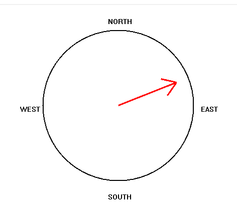

## Spis Treści
* [Wprowadzenie](#log-viewer)
* [Opis okna](#opis-okna)
* [Działanie programu](#działanie-programu)
## Log Viewer

Program odczytuje plik a następnie rysuje wykresy (Roll, Pitch, Yaw) oraz kompas, dodatkowo program pozwala na symulacje odczytów pokazując dane miejce w wykresie oraz przedstawiając wykres Yaw na kompasie.
## Opis okna

Po lewej stronie wykresów znajdują się przyciski (+, -) odpowiadające za zmiane skali amplitudy.
Pod wykresami znajdują się przyciski (+, -) odpowiadające ze zmiane skali czasu.
Po prawej stronie wykresów znajdują się oznaczenia wartości jednej kratki wykresu.

Podczas pracy symulacji na kompasie pokazuje się strzałka wskazująca na dany kierunek.

Przycisk "Start" jest odpowiedzialny za start symulacji.
Przycisk "Clear" jest odpowiedzialny za czyszczenie okna np po wykonanej symulacji.
Przycisk "Load" otwiera okno wyboru pliku *.log.
Pole tekstowe "Error Num" pozwala użytkownikowi wprowadzić liczę odczytów do pominięcia;
## Działanie Programu
Uzytkownik wybiera plik za pomocą okna otwrtego przyciskiem "Load".
Następnie użytkownik ustawia skale czasu i amplitudy tak aby dane z pliku były dobrze widoczne.
Użytkownik ustawia liczbę odczytów do pominięcia.
Ostatecznie użytkownik uruchamia symulacje przyciskiem "Start".
